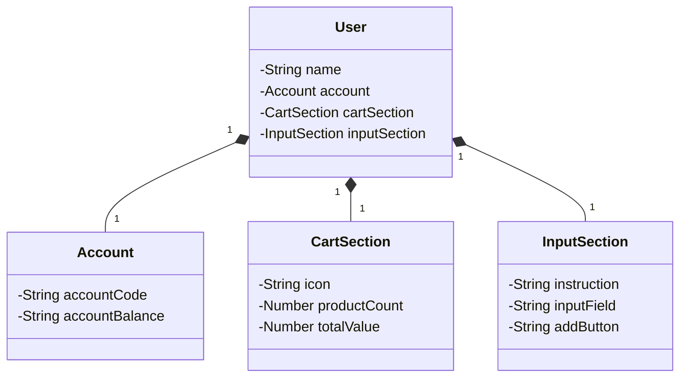

Meu primeiro projeto de API em java 17 com maven.. 

```mermaid
classDiagram
    class User {
        -String name
        -Account account
        -CartSection cartSection
        -InputSection inputSection
    }

    class Account {
        -String accountCode
        -String accountBalance
    }

    class CartSection {
        -String icon
        -Number productCount
        -Number totalValue
    }

    class InputSection {
        -String instruction
        -String inputField
        -String addButton
    }

    User "1" *-- "1" Account
    User "1" *-- "1" CartSection
    User "1" *-- "1" InputSection
 

```

Link do figma : https://www.figma.com/design/7bOAKXJZZIa9yEFGpg819j/Untitled?t=d5IQXEKCMqqWqhAN-1

