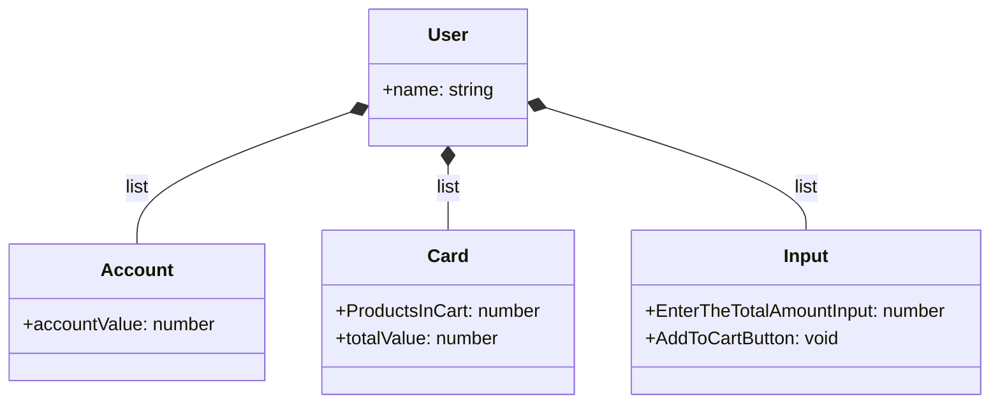

Meu primeiro projeto de API em java 17 com maven.. 

```mermaid
classDiagram
    class User {
        +name: string
    }
    class Account {
        +accountValue: number
    }
    class Card {
        +ProductsInCart: number
        +totalValue: number
    }
    class Input {
        +EnterTheTotalAmountInput: number
        +AddToCartButton: void
    }

    User *-- Account : list
    User *-- Card : list
    User *-- Input : list

 

```
